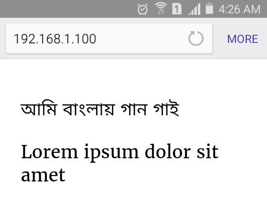
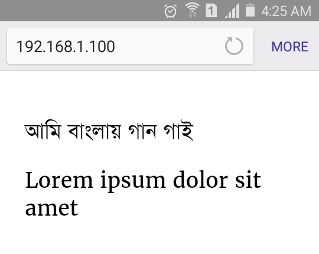

# SolaimanLipi-Embed

Embed SolaimanLipi to web pages and apps, the easiest way.

# About SolaimanLipi

SolaimanLipi, the popular Bangla Unicode font, is developed by [Solaiman Karim](mailto:solaiman@ekushey.org) at [Ekushey](http://www.ekushey.org/index.php/page/solaimanlipi).

# How To Use

Simple add the following line to HTML.

```html
<link href='http://minhazul-haque.github.io/SolaimanLipi-Embed/css/SolaimanLipi.css' rel='stylesheet' type='text/css'>
```

And then set the following CSS to the target element.

```css
.container {
    font-family: 'Merriweather','SolaimanLipi',sans-serif;
}
```

And then the page changes from this



to this


